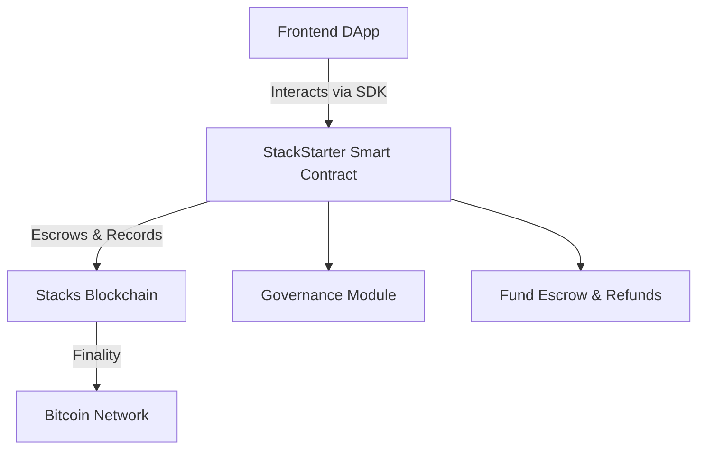

# StackStarter: Decentralized Crowdfunding on Stacks

[](https://clarity-lang.org)

**StackStarter** is a decentralized crowdfunding protocol powered by the Stacks L2 blockchain and secured by Bitcoin. It enables trustless campaign creation, transparent fund management, and community-driven governance.

---

## 📌 Table of Contents

* [Overview](#overview)
* [Features](#features)
* [Architecture](#architecture)
* [Smart Contracts](#smart-contracts)
* [Installation & Deployment](#installation--deployment)
* [Usage Examples](#usage-examples)
* [Security](#security)
* [Roadmap](#roadmap)

---

## 🚀 Overview

StackStarter empowers project creators to launch blockchain-based fundraising campaigns with automated escrow, contributor voting, and transparent settlement on Bitcoin via the Stacks protocol.

Key highlights:

* 🔒 Bitcoin-secured STX escrow
* 🛠️ Custom campaign configuration
* 🗳️ Contributor governance with weighted voting
* 🔁 Automatic refunds for failed campaigns
* 🧠 Fully programmable via Clarity

---

## 🌟 Features

### 🧱 Core Functionality

* **Campaign Lifecycle Management**
  Create, fund, and finalize campaigns with custom parameters (goal, deadline, min. contribution).
* **Secure Escrow & Payout**
  STX funds are escrowed and automatically distributed upon success or refunded upon failure.
* **Community Governance**
  Optional voting system where contributors can approve or reject fund release proposals.
* **Transparent State Tracking**
  On-chain milestone status, voting results, and fund flow.

### 🧩 Advanced Capabilities

* Platform fee configuration (default: 2.5%)
* Emergency campaign pause (admin-only)
* Campaign cancellation (by creator)
* Contributor allowlist (max 500/campaign)
* Extendable voting periods

---

## 🏗️ Architecture



### Modules

* **Campaign Manager**: Initializes and tracks campaign status.
* **Fund Escrow**: Handles STX contributions, fee processing, payouts/refunds.
* **Governance Engine**: Manages voting logic with weighted contribution-based votes.
* **Access Control**: Role-based permissions for creators, contributors, and contract owner.

---

## 🔐 Smart Contracts

### Core Functions

| Function                   | Description                       | Access        |
| -------------------------- | --------------------------------- | ------------- |
| `create-campaign`          | Start a new campaign              | Public        |
| `contribute`               | Contribute STX to campaign        | Public        |
| `claim-funds`              | Withdraw raised funds if goal met | Creator       |
| `request-refund`           | Get refund if campaign fails      | Contributor   |
| `vote`                     | Cast vote on fund disbursement    | Contributor   |
| `cancel-campaign`          | Cancel active campaign            | Creator/Admin |
| `set-platform-fee-rate`    | Update fee rate (default: 2.5%)   | Owner         |
| `emergency-pause-campaign` | Halt campaign activity            | Owner         |

### Data Structures

```clarity
(define-map campaigns
  uint
  {
    creator: principal,
    title: (string-ascii 64),
    goal: uint,
    raised: uint,
    deadline-height: uint,
    status: uint,  // 0: Active, 1: Success, 2: Failed
    voting-enabled: bool,
    votes-for: uint,
    votes-against: uint
  })

(define-map contributions
  { campaign-id: uint, contributor: principal }
  {
    amount: uint,
    refunded: bool,
    voting-power: uint
  })
```

---

## ⚙️ Installation & Deployment

### Prerequisites

* [Clarinet](https://docs.hiro.so/clarinet)
* [Hiro Wallet](https://wallet.hiro.so)
* Node.js v18+


## 🧪 Usage Examples

### Create a Campaign

```typescript
await callPublicFunction('create-campaign', {
  title: "Web3 Social Network",
  goal: 500_000,          // 500 STX
  duration: 4320,         // ~30 days (144 blocks/day)
  votingEnabled: true,
  minContribution: 100    // 0.1 STX
}, creatorAddress);
```

### Contribute to Campaign

```clarity
(contract-call? .stackstarter contribute 1 10000) ;; 0.1 STX to campaign ID 1
```

### Withdraw Funds (if successful)

```clarity
(contract-call? .stackstarter claim-funds 1)
```

### Request Refund (if failed)

```clarity
(contract-call? .stackstarter request-refund 1)
```

---

## 🔐 Security

### Considerations

* Input sanitization & validation
* Anti-replay & double-spend protections
* Role-based access control (creator/contributor/owner)
* Time-locks for campaign deadline enforcement

### Example Checks

```clarity
(asserts! (is-eq tx-sender (get creator campaign)))    ;; Only creator
(asserts! (>= (get raised campaign) (get goal campaign))) ;; Goal met
(asserts! (not (get refunded contribution)))           ;; Prevent double refunds
```

---

## 🛣️ Roadmap

### Coming Soon

* ✅ Milestone-based payouts
* 🎨 NFT rewards for contributors
* 🌉 Cross-chain support (e.g., BTC via sBTC)
* 📱 Mobile SDK & UI components
* 🧠 DAO governance extensions

### Research Directions

* Privacy-preserving donations
* Insurance pools for failed campaigns
* Reputation & trust scoring
* DeFi integrations (escrow yield)
